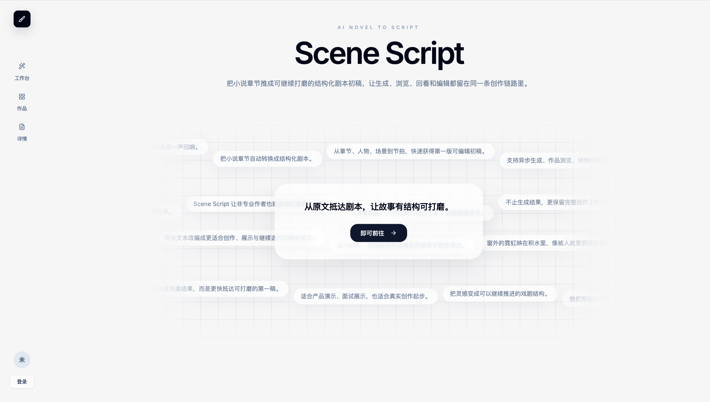
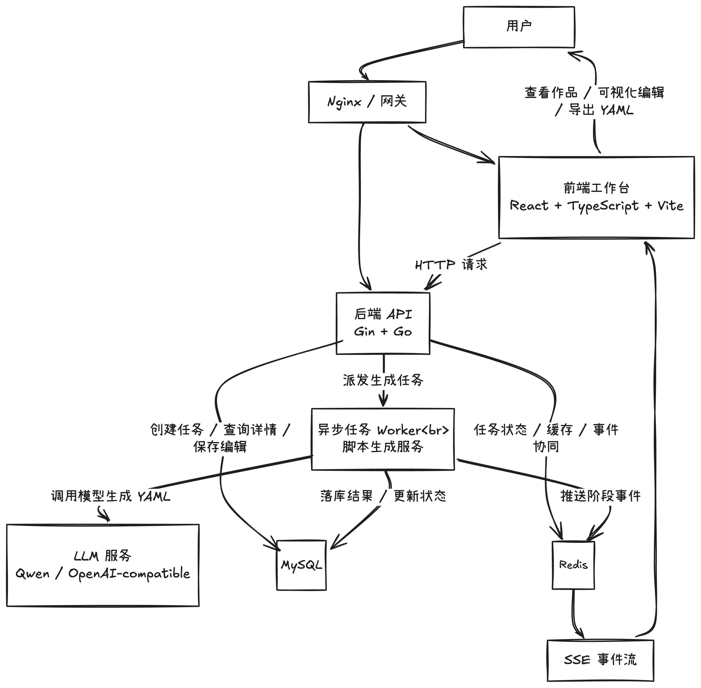
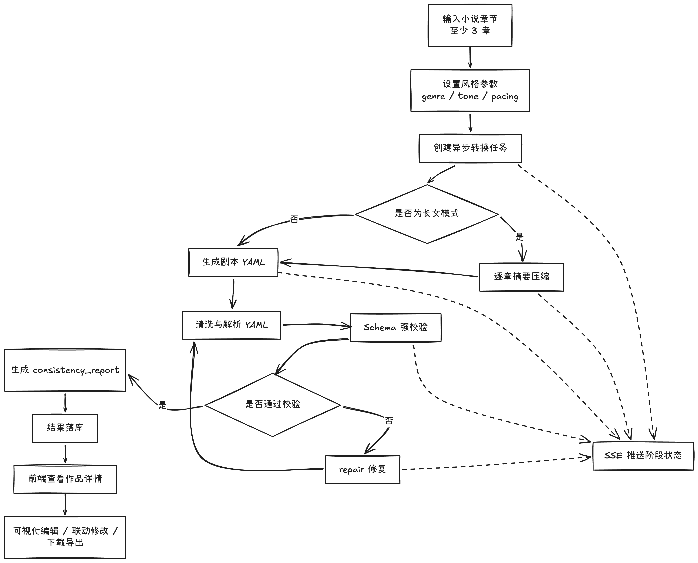

# Scene Script

Scene Script 是一款面向小说作者、网文作者和非专业编剧的 **AI 小说转剧本工具**。它可以把 **3 章及以上** 的小说文本自动转换为 **结构化 YAML 剧本初稿**，并提供可视化查看、编辑、联动修改与一致性质检，帮助作者更快完成从小说到剧本的第一轮改编。

**产品首页预览：**



## 视频与文档

> 请将最终路演视频上传到 `bilibili / 阿里云盘 / 夸克网盘` 等可公开访问平台，并把真实链接替换到下面这一行。评审通常会优先查看这里。

- Demo 视频链接：`请替换为可直接访问的视频地址`
- YAML Schema 文档：[详情入口](docs/schema/script-schema.md)
- AI 转换链路说明文档：[详情入口](docs/script-convert-guide.md)

## 题目对应

题目三：AI 小说转剧本工具

原议题如下：

> 很多小说作者希望将自己的作品改编成剧本，请开发一款 AI 辅助剧本创作工具，降低改编门槛，提升效率。要求：能将 3 个章节以上的小说文本自动转换为结构化剧本（YAML 格式），让作者可以快速获得可编辑、可进一步打磨的剧本初稿。请额外写一篇文档，定义剧本的 YAML Schema。文档中需说明该 Schema 的设计原因。

本项目对应实现如下：

- **基础要求对应**：支持输入 `3` 章及以上小说内容，并生成结构化剧本 `YAML`
- **结果形态对应**：输出结果不是一次性文本，而是可查看、可编辑、可继续打磨的剧本初稿
- **文档交付对应**：提供独立的 YAML Schema 文档，并说明 Schema 的设计原因
- **产品补充能力**：在题目基础上额外实现了异步任务、SSE 状态流、全文导入、长文模式、一致性质检、结构化编辑工作台和单场景 AI 重写

## 项目定位

- 面向希望把小说快速改编为剧本初稿的作者
- 输出可解析、可编辑、可维护的结构化 YAML，而不是一次性自由文本
- 用人物表、地点表和一致性质检降低长篇改编中的结构错误
- 让作者在 AI 生成后继续打磨，而不是被动接受结果

## 核心亮点

- **单场景 AI 重写**

  作者可以基于已有作品，对单个场景继续发起 AI 打磨和局部重写，而不是每次都重新生成整部剧本，这是超出题目基础要求的额外亮点。
- **结果保存与编辑**

  生成结果不是一次性文本，而是可保存、可查看、可编辑的结构化剧本工作台，支持 YAML 视图、结构树视图和表单联动编辑。
- **全文导入自动解析**

  支持直接粘贴整篇小说正文或上传 `txt / md / markdown` 文件，系统会自动拆分章节并进入人工确认流程，明显降低作者从原稿进入剧本改编的使用门槛。
- **一致性质检**

  系统会自动生成 `consistency_report`，检查角色缺失、地点缺失、悬空引用等问题，把能力从“生成”提升为“生成 + 校验”。
- **异步任务**

  剧本生成不是阻塞式接口，而是先创建任务、再后台执行，避免长文生成时前端长时间等待，也更适合作品历史管理和失败重试。
- **SSE 任务事件流**

  前端通过 SSE 订阅任务进度，实时展示 `queued`、`summarizing`、`generating`、`validating`、`repairing`、`persisting` 等阶段，让生成过程可见、可追踪。
- **长文模式压缩**

  当输入篇幅较大时，系统会先逐章摘要压缩，再进入剧本 YAML 生成流程，降低模型超时、输出截断和结构崩坏风险。
- **repair 自动修复**

  首轮生成若未通过 YAML 解析或 Schema 校验，系统不会直接失败，而是进入 repair 流程，基于错误信息重新修复输出结果。

## 核心能力

### 1. 小说输入

- 支持逐章输入小说内容
- 支持整篇文本粘贴后自动拆章
- 支持上传 `txt / md / markdown` 文件后自动拆章
- 当前工程稳定输入范围为 `3~12` 章，推荐 `5~10` 章

### 2. AI 剧本生成

- 支持设置 `genre`、`tone`、`pacing`
- 输出统一的 YAML 剧本结构，而不是普通段落文本
- 保留章节、场景、节拍三级结构，便于后续编辑

### 3. 结果查看与编辑

- 概览视图：展示章节、场景、节拍、角色、地点统计
- YAML 视图：支持查看、复制和下载结构化结果
- 结构视图：按章节 -> 场景 -> 节拍继续打磨内容
- 注册表视图：单独维护人物表和地点表

### 4. 一致性质检

- 检测被引用但未定义的角色
- 检测被引用但未登记的地点
- 检测已定义但未使用的悬空引用
- 生成 `consistency_report`，辅助作者二次审查

### 5. 工程能力

- 后端采用异步任务模式，避免长时间阻塞接口
- 前端通过 SSE 订阅进度，实时显示生成阶段
- 长文模式会先逐章摘要压缩，再生成最终 YAML
- 失败任务支持新建任务重试并保留历史

## 项目整体架构图



## 核心链路图



## Schema 设计说明

项目使用统一的剧本 Schema，核心结构如下：

```yaml
version: "1.0"
metadata: {}
dramatis_personae: []
settings: []
chapters: []
consistency_report: {}
```

设计思路如下：

- `dramatis_personae`：集中维护人物信息，减少角色称呼漂移
- `settings`：集中维护地点信息，支持别名和软匹配
- `chapters -> scenes -> beats`：把小说叙事拆成可继续打磨的剧本单元
- `consistency_report`：把角色、地点、悬空引用问题显式暴露出来

完整字段定义、校验规则和设计原因见 [script-schema.md](docs/schema/script-schema.md)。

## 项目结构

```text
scene-script/
├── config/                  # 配置文件
├── docs/                    # 提交文档、Schema 文档、Demo 台词
├── frontend/                # React + Vite 前端
├── internal/                # Go 后端核心实现
│   ├── handler/             # HTTP 入口
│   ├── logic/               # 业务逻辑
│   ├── model/               # 数据模型与 YAML Schema 映射
│   └── service/             # AI 转换、校验、修复与任务流
└── pkg/                     # 公共组件与基础能力
```

## 关键流程

### 1. 生成流程

1. 用户输入不少于 `3` 章的小说内容
2. 选择体裁、语气和节奏
3. 前端调用 `POST /api/v1/script/convert`
4. 后端创建异步任务并返回 `detail_url`、`event_url`
5. 后台执行摘要压缩、YAML 生成、Schema 校验和一致性检查
6. 前端通过 SSE 获取状态，完成后回拉详情

### 2. 编辑流程

1. 用户进入作品详情页
2. 在结构视图中修改章节、场景、节拍
3. 在人物表和地点表中修改注册信息
4. 系统自动同步相关 `pov`、`speaker`、`location`
5. 保存后继续回看、导出或二次打磨

## 技术栈

- 后端：`Go`、`Gin`、`Eino`、`sqlx`、`MySQL`、`Redis`
- 前端：`React`、`TypeScript`、`Vite`、`Tailwind CSS`、`Zustand`
- AI：`Qwen / OpenAI-compatible` 接口
- 数据格式：`YAML`

## 差异化实现

除通用框架与基础 UI 组件外，以下业务能力为本项目原创实现：

- 小说章节输入到结构化剧本 YAML 的完整转换链路
- PromptManager 驱动的 YAML 生成、修复与契约约束
- 异步任务 + SSE 状态流的 AI 剧本生成模式
- 长文自动摘要压缩后再生成的稳定性治理
- 失败任务新建重试并保留历史的任务策略
- 全文导入、自动拆章、人工确认导入的输入体验
- 结构树 + 表单 + YAML 源码联动的剧本编辑工作台
- 人物表 / 地点表与剧本正文引用的联动编辑

## 快速开始

推荐优先使用 Docker 方式启动，评审和首次体验时更省步骤，也更接近项目的完整运行形态。

### 方式一：Docker 启动

1. 准备 Docker 配置文件

- 复制 `scripts/docker/config.example.yaml` 为 `scripts/docker/config.yaml`
- 按实际环境填写 LLM 配置、JWT 密钥等必要参数

1. 执行一键启动脚本

```bash
./scripts/start.sh
```

该脚本会自动完成以下步骤：

- 构建前端生产静态资源
- 校验 Docker Compose 配置
- 启动 `MySQL`、`Redis`
- 初始化数据库
- 构建并启动后端服务
- 启动 `Nginx` 并代理前后端访问

1. 启动完成后的访问地址

- 前端访问地址：`http://localhost:8080`
- 后端健康检查：`http://localhost:8000/ping`

1. 常用命令

```bash
# 查看容器状态
docker compose -f scripts/docker/docker-compose.yaml ps

# 查看日志
docker compose -f scripts/docker/docker-compose.yaml logs -f

# 停止环境
./scripts/stop.sh
```

### 方式二：本地开发

```bash
go run ./cmd
```

启动前请先准备后端依赖：

- 数据库并执行 `scripts/db/init.sql`
- 配置文件 `config/config.yaml`
- 可用的模型服务配置

前端开发环境：

```bash
cd frontend
npm install
npm run dev
```

前端生产构建：

```bash
cd frontend
npm run build
```
